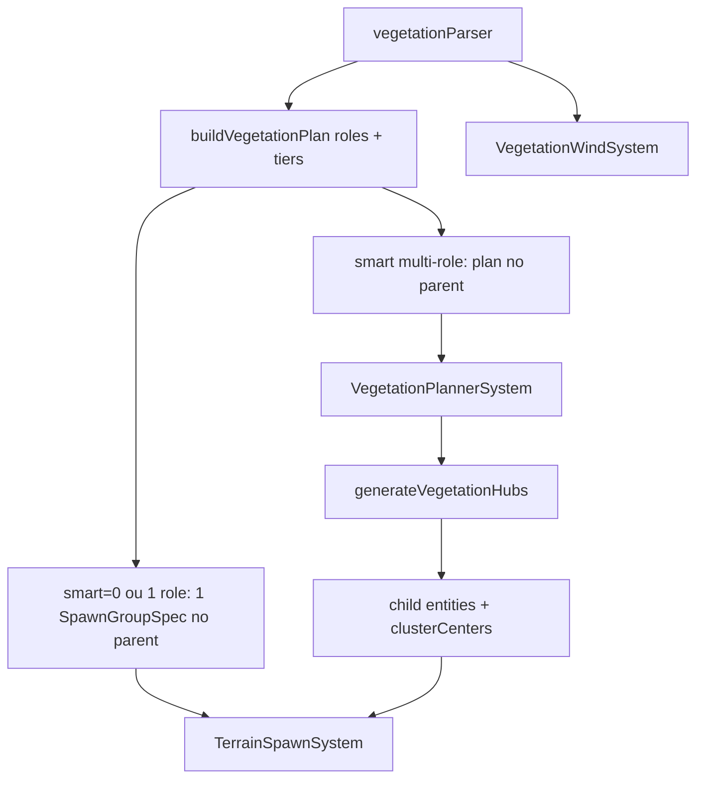

# Vegetation plugin

Carpet estático (grama, plantas, flores) via `SpawnGroupSpec` + InstancedMesh2, wind opcional, e **smart patch** (layers coordenadas com hubs partilhados).

Código: `src/plugins/vegetation/`. Recipe: `<Vegetation>`. Plugin: `VegetationPlugin`.

## Fluxo



1. **Parse** — classifica meshes, monta `VegetationPatchPlan`, prefetch AABB, regista URLs de wind.
2. **Legacy** — um `SpawnGroupSpec` no entity `<Vegetation>` (hubs gerados pelo spawner).
3. **Smart** — parent marca `SpawnerPending.spawned=1`; `VegetationPlannerSystem` (setup, **antes** de `TerrainSpawnSystem`) gera hubs, cria filhos por layer com `clusterCenters`, cada um com `SpawnerPending`.
4. **Spawn** — path normal do spawner (slope, water, exclusion, instancing).
5. **Wind** — `maybePatchVegetationWindMaterial` nas pools InstancedMesh2 das URLs registadas.

## Recipe XML

```html
<!-- simple-rpg valley ring: keep carpet near the city (±58), not a ±90 blanket -->
<Vegetation
  meshes="/assets/meshes/vegetation/grass.glb /assets/meshes/vegetation/flower_yellowA.glb"
  density-per-km2="55000"
  seed="41"
  region-min="-58 0 -58"
  region-max="58 0 58"
  smart="1"
  cluster-count="40"
  cluster-radius="3.4"
  flower-near-radius="2.4"
  flower-density-ratio="0.34"
  plant-density-ratio="0.45"
  avoid-overlaps="0"
  wind="1"
></Vegetation>
```

`avoid-overlaps="0"` allows a dense carpet, but **`<SpawnExclusion>` discs are always honoured** (spawner occupancy). Pair regions with city exclusion / biome edges so grass does not fill the plaza or deep biomes.

**simple-rpg:** peri-urban carpet → `public/world/spawn/ring.xml`; deep biomes →
`vegetation/crystal-vale.xml`. Extra props (not grass) go in
`clutter/crystal-vale.xml` — see `examples/simple-rpg/public/world/context.md`
§ Richness layers.

### Atributos

| Atributo                            | Default                    | Notas                                                      |
| ----------------------------------- | -------------------------- | ---------------------------------------------------------- |
| `meshes`                            | (obrigatório)              | URLs GLB, espaço ou vírgula                                |
| `density-per-km2`                   | `90000` se omitido `count` | Objetos/km² na projeção XZ                                 |
| `count`                             | —                          | Alternativa a density (fixo)                               |
| `seed`                              | `1`                        | PRNG (hubs + layers)                                       |
| `region-min` / `region-max`         | `±40`                      | Caixa XZ (`y` ignorado)                                    |
| `smart`                             | `1`                        | `0` = flat legado                                          |
| `cluster-count`                     | `48`                       | Hubs de grama                                              |
| `cluster-radius`                    | `3.5`                      | Raio amostra em volta do hub (grama)                       |
| `flower-near-radius`                | `2.2`                      | Raio da layer flower (mesmos hubs)                         |
| `flower-density-ratio`              | `0.15`                     | Fração da density base (flower)                            |
| `plant-density-ratio`               | `0.25`                     | Fração da density base (plant)                             |
| `mesh-roles`                        | —                          | Override: `url:grass,/b.glb:flower`                        |
| `scale-min` / `scale-max`           | tiers se omitidos          | Se definidos, substituem ranges de tier em todas as layers |
| `scale-axis-min` / `scale-axis-max` | perfil foliage             | Escala não-uniforme (spawner)                              |
| `max-slope-deg`                     | `35`                       | Foliage default no parser                                  |
| `avoid-water`                       | `1`                        |                                                            |
| `avoid-overlaps`                    | `0`                        | Carpet denso: overlaps off por omissão                     |
| `max-distance`                      | `110`                      | Cull render                                                |
| `footprint-radius`                  | `0.2`                      |                                                            |
| `wind`                              | `1`                        | Sway vertex                                                |
| `align-to-terrain`                  | `1`                        |                                                            |
| `ground-align`                      | `aabb`                     |                                                            |
| `random-yaw`                        | `1`                        |                                                            |

### Variação visual (spawn-variation)

`<Vegetation>` usa preset **`foliage`** via `resolveVariationSpec` (hue/sat/brightness/contrast). Overrides:

- `variation` — `none` \| `tree` \| `foliage` \| `rock`
- `hue-jitter-deg`, `saturation-min/max`, `brightness-min/max`, `contrast-min/max`, `variation-spatial`

Ver [`../spawn-variation/`](../spawn-variation/) (`presets.ts`, `resolve.ts`).

## Roles

`classifyVegetationRole(url)` (`roles.ts`):

| Role     | Filename                                  |
| -------- | ----------------------------------------- |
| `grass`  | `grass*`, contém `grass`                  |
| `flower` | `flower*`, contém `flower`                |
| `plant`  | `plant*`, `fern`, `weed`, ou desconhecido |

Override: `mesh-roles="/a.glb:grass,/b.glb:flower"`.

## Size tiers

`resolveSizeTier(url)` (`size-tier.ts`):

| Tier   | Altura nativa Y (m) | scale default |
| ------ | ------------------- | ------------- |
| small  | &lt; 0.22           | 0.9–1.4       |
| medium | 0.22–0.35           | 1.0–1.8       |
| large  | &gt; 0.35           | 1.1–2.2       |

Sem AABB (prefetch async): hints `large`/`tall`/`short`/`small` no nome. Layer usa **união** dos ranges dos meshes do role. `scale-min`/`scale-max` no patch **substituem** (não multiplicam) esses ranges.

## Smart layers

Ativo se `smart=1` **e** ≥2 roles distintos.

| Layer  | Density                | Hubs            | `clusterRadius`           |
| ------ | ---------------------- | --------------- | ------------------------- |
| grass  | 100% base              | gera / partilha | `cluster-radius`          |
| plant  | `plant-density-ratio`  | partilha        | médio (~near×1.4, capped) |
| flower | `flower-density-ratio` | partilha        | `flower-near-radius`      |

Ordem de criação dos filhos: grass → plant → flower (eids crescentes → spawn estável).

`smart=0` ou um só role → um spec no parent (legado).

## Módulos

| Ficheiro            | Função                   |
| ------------------- | ------------------------ |
| `plugin.ts`         | Recipe + systems         |
| `parser.ts`         | XML → plan / legacy spec |
| `plan.ts`           | `buildVegetationPlan`    |
| `roles.ts`          | Classify + `mesh-roles`  |
| `size-tier.ts`      | Tiers + scale            |
| `hubs.ts`           | Generate / store hubs    |
| `patch-context.ts`  | Runtime plan por entity  |
| `spec-from-plan.ts` | Layer → `SpawnGroupSpec` |
| `planner-system.ts` | Materializa filhos       |
| `wind.ts`           | GLSL sway                |
| `components.ts`     | `Vegetation.wind`        |
| `parse-meshes.ts`   | Split URLs               |

## Spawner

`SpawnGroupSpec.clusterCenters?: [x,z][]` — se não vazio, `TerrainSpawnSystem` **não** regenera hubs. Documentado em [`../spawner/context.md`](../spawner/context.md).

Altura Y: mesmo path density-aware do spawner (`sampleTerrainSurface` → `meshSurfaceResolutionForPoint`). Carpet no anel periurbano (±58) assenta no falloff do pad / estradas cardeais; lattice grosso sozinho → erva a flutuar nas saídas da cidade.

## Wind

- URLs registadas no parse (`registerVegetationWindUrl`).
- Patch de material **antes** do snapshot InstancedMesh2 (`auto-instance.ts`).
- Amp base ~0.22; direção via weather wind.

## Testes

- `tests/unit/vegetation/vegetation.test.ts` — recipe, smart/legado, wind
- `tests/unit/vegetation/roles-plan.test.ts` — roles, tiers, plan layers
- `tests/unit/spawner/cluster-centers.test.ts` — contrato `clusterCenters`

## Assets (simple-rpg)

GLBs Y-up em `examples/simple-rpg/public/assets/meshes/vegetation/` (bpy; scale tipicamente ~0.9–2.8 no recipe — meshes nativos ~0.2–0.4 m).

```bash
cd VibeGame/examples/simple-rpg
npm run generate-vegetation
# ou: Animator3D/.venv/bin/python scripts/generate_vegetation_glb.py
```

Patches na cena (`Include`):

- `public/world/spawn/ring.xml` — anel do vale (±58, junto à cidade)
- `public/world/vegetation/crystal-vale.xml` — biomas profundos (fora do anel)

Pipeline bpy + git: [`examples/simple-rpg/scripts/README_VEGETATION.md`](../../../examples/simple-rpg/scripts/README_VEGETATION.md). Contratos de cidade: [`examples/simple-rpg/public/world/context.md`](../../../examples/simple-rpg/public/world/context.md).
